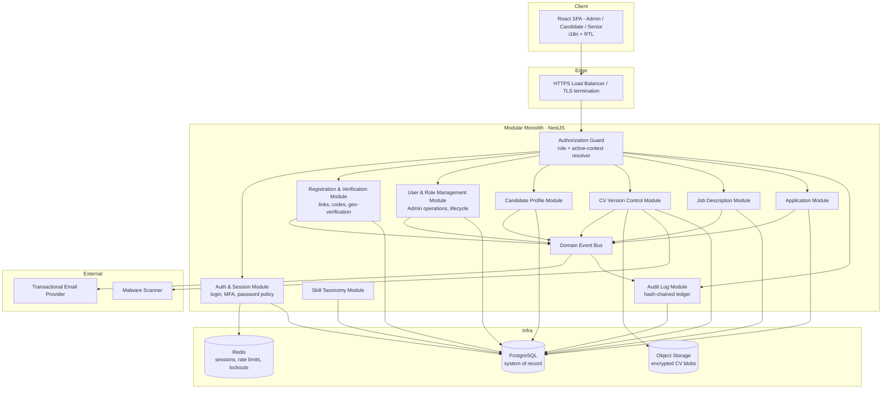
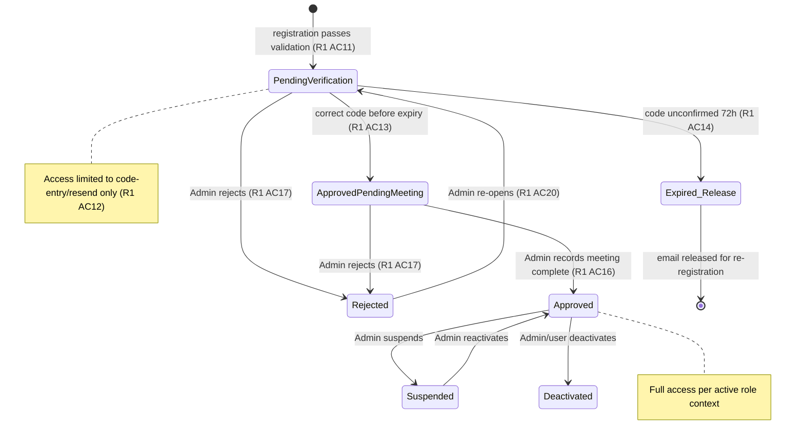
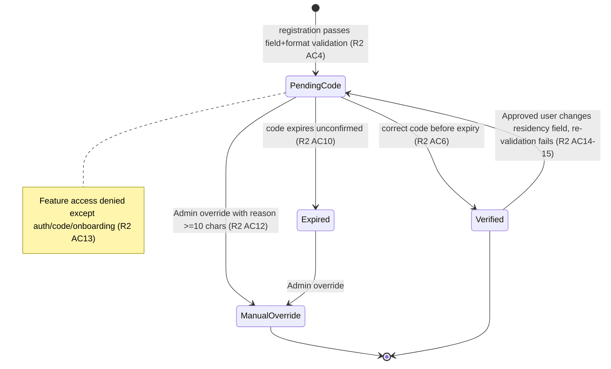

# Design Document

## Overview

This document describes the design for **Phase 1** of the HasoubLabs Recruitment Platform: a greenfield web application that provides foundational identity, access control, candidate profiles, CV version control, job postings, applications, and a tamper-evident audit trail for the three platform roles (Admin, Candidate, Senior) plus the external Recruiter actor (Phase 2 email-only).

Phase 1 deliberately excludes the AI_Engine, reviews, notes, recruiter handoff, chat, mailbox/WhatsApp sync, the full notification service, and scoring (Requirements 9–21). The architecture below is scoped to Requirements 1–8 and the Cross-Cutting Constraints, but is structured so those deferred capabilities can be added as new bounded modules without reworking the Phase 1 core.

### Design Goals

- **Server-authoritative security.** Every authorization decision is made on the server from the account's roles and its active role context. There are no client-trusted permission claims and no per-user overrides (Requirement 3).
- **Immutability where the requirements demand it.** CV versions, application CV snapshots, and audit entries are append-only and never mutated (Requirements 5, 7, 8).
- **Tamper-evidence by construction.** The Audit_Log is a hash-chained, append-only ledger that both records every significant action and lets the platform reconstruct entity state and detect tampering (Requirement 8).
- **Extensibility for Phase 2.** Domain modules communicate through an internal domain-event bus and clean service boundaries so AI, messaging, and scoring modules can subscribe later without touching Phase 1 write paths.

### Key Design Decisions and Rationale

| Decision | Rationale |
| --- | --- |
| Modular monolith (not microservices) | Meets the 3s/500-user performance and 99.5% availability targets with far less operational overhead. Bounded modules keep Phase 2 extraction possible. |
| PostgreSQL as system of record | Strong transactional guarantees are essential for the atomic multi-step operations and rollback in Requirement 8 AC5, and row-level constraints enforce several invariants directly. |
| Object storage for CV binaries, DB for metadata | CV files are large, immutable, encrypted blobs; keeping bytes out of the relational store keeps transactions fast and lets checksum/version metadata live under transactional control. |
| Hash-chained audit ledger in its own table | Gives independent integrity verification (Requirement 8 AC8) and append-only semantics enforced at the database layer. |
| Domain-event bus internal to the monolith | Decouples side effects (email, future notifications/AI) from the transactional write path, so Phase 2 subscribers attach without modifying core logic. |

## Architecture

### Technology Stack

The stack is a recommendation justified against the constraints; specific library choices can be adjusted during implementation without changing the architecture.

| Concern | Choice | Justification |
| --- | --- | --- |
| Runtime / language | **TypeScript on Node.js** (or equivalently typed backend such as Kotlin/Spring or C#/.NET) | Strong typing reduces state-machine and RBAC defects; large ecosystem for PDF, crypto, email. |
| API framework | **NestJS** (modular, DI-based) | First-class module boundaries map directly to bounded contexts and keep Phase 2 modules isolated. |
| Database | **PostgreSQL 15+** | ACID transactions, `SERIALIZABLE`/row locks for atomicity, `CHECK`/unique constraints, partial unique indexes for "exactly one active", generated columns for hash chaining. |
| ORM / query layer | **Prisma** or **TypeORM** with explicit transactions | Typed schema; explicit transaction boundaries for multi-step atomic operations. |
| Object storage | **S3-compatible store** (AWS S3 / MinIO) with SSE-KMS | Encrypted-at-rest immutable blob storage for CV files; versioning and object-lock support immutability. |
| Cache / rate-limit / lockout state | **Redis** | Sliding-window rate limits, verification-code attempt counters, session store, code-entry lockouts. |
| Frontend | **React + TypeScript**, i18n via **react-i18next**, RTL via CSS logical properties + `dir="rtl"` | SPA with per-account language preference; RTL for Arabic. |
| Email | **Transactional email provider API** (SES / SendGrid / Postmark) behind an `EmailPort` interface | Phase 1 needs only outbound transactional email; interface allows Phase 2 mailbox sync to replace the adapter. |
| Malware scanning | **ClamAV** (or cloud scanning API) behind a `MalwareScannerPort` | Pluggable scan step in the CV pipeline. |
| Auth / MFA | Server sessions + **TOTP** (RFC 6238) for MFA | MFA offered to all, required for Admin (Security constraint). |

### System Components



### Request and Data Flow

1. **All traffic is HTTPS** (Security constraint); the load balancer terminates TLS. HTTP is refused/redirected.
2. Every request passes through the **Authorization Guard** before reaching any domain handler. The guard resolves the session, the account, its roles, and the **active role context**, then evaluates the required capability. Unauthenticated requests are rejected except for the explicitly public endpoints (registration-via-link, code entry, login, password reset — Requirement 3 AC8).
3. Domain handlers execute **write operations inside a single database transaction**. Within that transaction the handler both mutates domain tables and appends the corresponding Audit_Log entry, so audit completeness and transaction atomicity share one commit boundary (Requirement 8 AC1, AC5).
4. **Side effects** (sending email, and in Phase 2 notifications/AI) are emitted as **domain events** after commit, never inline in the transaction. This keeps the write path fast and lets Phase 2 subscribers attach.
5. **CV binaries** are streamed to encrypted object storage; only metadata + checksum live in PostgreSQL.

### Bounded Modules and Phase 2 Extensibility

Each module owns its tables and exposes a service interface. Cross-module reads go through service interfaces, not shared table access. The domain-event bus is the sole integration seam for side effects. Phase 2 modules (AI_Engine, Reviews, Notes, RecruiterPackage, Chat, EmailSync, WhatsApp, Notifications, Scoring) will be added as new modules that **subscribe to existing events** (e.g., `CvVersionActivated`, `ApplicationSubmitted`, `JdCreated`) and **read through existing service interfaces**, requiring no change to Phase 1 write logic.

## Components and Interfaces

### Authorization Guard (RBAC)

The guard is the single chokepoint for authorization (Requirement 3 AC1). It performs:

1. **Session resolution** — load the session from Redis; reject if absent or expired (30-min inactivity — Security constraint).
2. **Account status check** — if the account is not `Approved`, only authentication/code-entry/onboarding endpoints are permitted (Requirements 1 AC18, 2 AC13). `Suspended`/`Deactivated` accounts may only view a status notice (Requirement 3 AC11).
3. **Active-context resolution** — for a dual-role account, the active context is whichever role the user selected for the session (`candidate` or `senior`); for a single-role account the active context is that sole role; Admin accounts resolve to `admin` (Requirements 1 AC4, 3 AC1). Switching context re-derives capabilities and drops the previous context's data access (Requirement 3 AC10).
4. **Capability evaluation** — permissions are a pure function of `(roles, activeContext, targetResource)`. No per-user overrides exist (Requirement 3 AC1).

**Capability matrix (Phase 1):**

| Capability | Admin | Candidate context | Senior context |
| --- | --- | --- | --- |
| User & role management, lifecycle actions | ✅ | ❌ | ❌ |
| View any candidate profile / CV versions | ✅ | own only | ❌ |
| View any job description (any status) | ✅ | `Open` only | own (any status) + `Open` |
| Create/manage job descriptions | ✅ | ❌ | own only |
| View applicant list (name, role title, status only) | ✅ (full) | ❌ | own JDs only, limited fields |
| Submit / withdraw applications | ❌ | own only | ❌ |
| Audit log search (read-only) | ✅ | ❌ | ❌ |
| Platform configuration | ✅ | ❌ | ❌ |

**Non-disclosure of resource existence (Requirement 3 AC6):** When a request targets a resource the caller is not authorized to see, the guard returns an **identical authorization error** whether or not the resource exists, includes **no resource data**, and eliminates timing side-channels. The guard implements this by:

- Returning a single canonical `403`-style error body for both "not found" and "forbidden" in cross-tenant cases (a Candidate probing another Candidate's resource always gets the same response regardless of existence).
- Performing the authorization decision **before** any existence lookup for cross-owner access, so no branch depends on existence.
- Applying a **constant-time response floor**: denied cross-owner requests are held to a fixed minimum latency (a padded delay to a target duration) so that "exists but forbidden" and "does not exist" are indistinguishable by timing.

```typescript
interface AuthorizationGuard {
  authorize(session: Session, required: Capability, target?: ResourceRef): AuthorizationResult;
}
// AuthorizationResult = { allowed: true } | { allowed: false } // caller maps deny to the canonical, constant-time error
```

### Auth & Session Module

- **Password policy** (Security constraint): ≥10 characters, screened against a known-breached list (e.g., k-anonymity range query against a breached-password service or local bloom filter), no max below 64, stored with **bcrypt cost ≥12** (or Argon2id equivalent).
- **MFA**: TOTP enrollment offered to all accounts; **required for Admin** in production. MFA challenge occurs after primary credential check and before a full session is issued.
- **Sessions**: server-side session records in Redis, 30-minute idle expiry, rotation on privilege change (context switch, MFA completion).
- **Login/registration/CV/application rate limiting** (Security constraint): sliding-window counters in Redis keyed per source IP and per account; repeated failed logins lock the account pending user-initiated recovery.

### Registration & Verification Module

Owns registration links, account creation, the Verification_Code lifecycle, and the Geographic_Verification record. See the state machines below. Emits `RegistrationSubmitted`, `EmailVerified`, `AccountStatusChanged` events; the email subscriber sends verification codes and notices.

### User & Role Management Module

Admin-only operations: record meeting completion, reject, suspend, reactivate, add/remove roles, generate registration links, manual geo override, re-open rejected accounts. Every action writes an Audit_Log entry inside its transaction.

### Candidate Profile Module

Owns the structured profile, computes `Profile_Completeness` and `Application-Ready` per the single definitions in Requirement 4 AC6/AC7, validates email (RFC 5322 addr-spec + domain resolvability within 5s), phone (E.164), LinkedIn (HTTPS URL), and date ordering. Records before/after field values to the audit log on every change.

### Skill Taxonomy Module

Serves the canonical `Skill_Taxonomy`. When a Candidate or JD enters a term not in the taxonomy, it is stored linked to a normalized term and flagged for Admin review (Requirement 4 AC2–AC3).

### CV Version Control Module

Runs the upload pipeline (validate → scan → store → version), manages the active designation via a partial unique index, verifies checksums on retrieval, and never mutates or deletes a version. See "Key Design Details" below.

### Job Description & Application Modules

Own the JD `Draft/Open/Closed` lifecycle and the Application status lifecycle, including the immutable CV snapshot, idempotency of non-terminal applications, close-cascade, the 20-per-24h submission cap, and the `Application-Ready` gate.

### Audit Log Module

Append-only, hash-chained ledger. Exposes `append(entry, tx)` used within domain transactions and `search(filters)` for Admin read/search. Rejects any update/delete and records the attempt as a new entry. Provides `verifyChain()` for integrity checking and `reconstruct(entityRef)` for state reconstruction.

## Data Models

All timestamps are UTC at millisecond precision from an NTP-synchronized clock. Encrypted-at-rest fields use envelope encryption (KMS-managed data keys); the ciphertext is stored, and plaintext is available only to Admin-scoped server code paths.

### Account & Roles

```
Account
  id                UUID  PK
  full_name         varchar(100)
  email             citext  UNIQUE            -- case-insensitive uniqueness (R1 AC10)
  password_hash     text                       -- bcrypt cost >=12
  status            enum AccountStatus         -- exactly one at all times (R1 AC15)
  mfa_enabled       boolean
  mfa_secret        bytea  (encrypted)
  language          enum { ar, en }
  created_at        timestamptz
  updated_at        timestamptz

AccountStatus = PendingVerification | ApprovedPendingMeeting | Approved | Rejected | Suspended | Deactivated

RoleAssignment
  id            UUID PK
  account_id    UUID FK -> Account
  role          enum { Admin, Candidate, Senior }
  granted_by    UUID FK -> Account (Admin) | null (self via registration)
  granted_at    timestamptz
  UNIQUE(account_id, role)
  -- Application-level + trigger invariant: Admin cannot coexist with Candidate/Senior on one account (R1 AC5)

MeetingCompletion
  account_id    UUID FK -> Account
  recorded_by   UUID FK -> Account (Admin)
  recorded_at   timestamptz
```

### Registration & Geographic Verification

```
RegistrationLink
  id            UUID PK
  token         text UNIQUE           -- non-guessable, cryptographically random (R1 AC8)
  role          enum { Candidate, Senior }
  single_use    boolean
  used_at       timestamptz | null
  expires_at    timestamptz           -- <= 72h window
  created_by    UUID FK -> Account (Admin)

GeographicVerification
  id                    UUID PK
  account_id            UUID FK -> Account UNIQUE
  state                 enum { PendingCode, Verified, Expired, ManualOverride }
  residency_proof_type  enum { IsraeliPhone, IsraeliNationalId, IsraeliAddress }
  residency_proof_value bytea (encrypted at rest, Admin-only)   -- excluded from Senior/Candidate views (R2 AC16)
  override_by           UUID FK -> Account (Admin) | null
  override_reason       text | null                              -- >=10 chars when ManualOverride (R2 AC12)
  override_at           timestamptz | null
  updated_at            timestamptz

VerificationCode
  id                UUID PK
  account_id        UUID FK -> Account
  code_hash         text                 -- 6-8 digit code, stored hashed, single-use
  issued_at         timestamptz
  expires_at        timestamptz          -- issued_at + 72h (R2 AC5)
  consumed_at       timestamptz | null
  invalidated       boolean              -- set true when a newer code is requested (R2 AC9)
  attempt_count     int                  -- lock at 5 (R2 AC8); reset on new code
```

### Candidate Profile

```
CandidateProfile
  account_id     UUID PK/FK -> Account
  phone          varchar         -- E.164 (R4 AC1, AC11)
  summary        varchar(1000) | null
  linkedin_url   varchar(200) | null      -- HTTPS URL when present (R4 AC13)
  completeness   enum { Draft, Complete } -- derived, per R4 AC6
  updated_at     timestamptz

EducationEntry        (0-20 per profile)
  id, account_id FK, institution varchar(150), degree varchar(100),
  field_of_study varchar(100), enrolment enum { Enrolled, Graduated },
  start_year int (1950-2100), grad_year int (1950-2100)   -- grad_year >= start_year (R4 AC14)

WorkExperienceEntry   (0-20 per profile)
  id, account_id FK, employer varchar(150), role_title varchar(150),
  start_date date, end_date date | 'present'              -- end >= start (R4 AC14)

ProfileLanguage       (0-10 per profile)  account_id FK, language

Skill
  id            UUID PK
  taxonomy_id   UUID FK -> SkillTaxonomy | null
  raw_term      varchar(50)
  normalized    varchar(50)
  needs_review  boolean       -- true when not in taxonomy (R4 AC3)

CandidateSkill  (1-20 per profile)  account_id FK, skill_id FK

SkillTaxonomy
  id UUID PK, canonical_term varchar UNIQUE, active boolean
```

### CV Version Control

```
CvVersion
  id                UUID PK
  account_id        UUID FK -> Account
  version_number    int                     -- starts at 1, +1 per upload (R5 AC5)
  object_key        text                    -- pointer into encrypted object storage
  file_size         bigint
  sha256_checksum   char(64)                -- computed at upload (R5 AC5)
  uploaded_at       timestamptz
  scan_state        enum { Pending, Clean, Quarantined }
  is_active         boolean
  admin_designated  boolean                 -- true if Admin explicitly designated (R5 AC6)
  UNIQUE(account_id, version_number)
  PARTIAL UNIQUE INDEX (account_id) WHERE is_active = true   -- exactly one active (R5 AC6)
  -- No UPDATE of object_key/checksum/version_number after insert (immutability, R5 AC4)
```

CV binaries live in object storage under `object_key`, encrypted at rest (R5 AC11), with object-lock/immutability enabled so blobs cannot be overwritten or deleted (R5 AC4, AC12).

### Job Description & Application

```
JobDescription
  id                UUID PK
  creator_id        UUID FK -> Account (Senior or Admin)
  role_title        varchar(150)
  company_name      varchar(150)
  location          varchar(200)
  work_model        enum { Onsite, Hybrid, Remote }
  employment_type   enum { FullTime, PartTime, Contract, Freelance, Internship }
  experience_level  enum { Junior, Mid, Senior, Lead }
  openings          int | null
  recruiter_email   varchar | null           -- valid format when present
  description       varchar(5000)
  status            enum { Draft, Open, Closed }   -- never leaves Closed (R6 AC7)
  created_at        timestamptz
  updated_at        timestamptz

JobRequiredSkill  (1-20 per JD)  jd_id FK, skill_id FK

Application
  id                UUID PK
  candidate_id      UUID FK -> Account
  jd_id             UUID FK -> JobDescription
  cv_version_id     UUID FK -> CvVersion       -- snapshot at submission, immutable (R7 AC4)
  status            enum ApplicationStatus
  submitted_at      timestamptz
  PARTIAL UNIQUE INDEX (candidate_id, jd_id) WHERE status IN ('Submitted','Under Review')
    -- at most one non-terminal application per pair (R7 AC6)

ApplicationStatus = Submitted | Under Review | Forwarded to Recruiter | Withdrawn | Closed

ApplicationStatusHistory
  id, application_id FK, from_status, to_status, changed_by, changed_at
```

### Audit Log (append-only, hash-chained)

```
AuditLogEntry
  id              BIGSERIAL PK           -- monotonic sequence
  actor_id        UUID | 'system'
  action          varchar
  entity_type     varchar
  entity_id       text
  before_values   jsonb | null           -- changed fields only (R8 AC2, AC6)
  after_values    jsonb | null
  reason          text | null            -- when action requires one
  occurred_at     timestamptz            -- ms precision, NTP-synced (R8 AC2)
  prev_hash       char(64)               -- hash of previous entry
  entry_hash      char(64)               -- H(id || actor || action || entity || before || after || reason || occurred_at || prev_hash)
  -- INSERT-only; UPDATE/DELETE rejected by DB trigger and revoked grants (R8 AC3)
```

`entry_hash = SHA-256(canonical_serialization(entry_fields) || prev_hash)` forms a tamper-evident chain (R8 AC8). `verifyChain()` recomputes hashes in sequence; any mismatch raises a tampering alert to Admins. Retention ≥7 years; entries are exempt from candidate deletion and are anonymized in place where legally required (R8 AC7, Data Retention constraint).

### Account Lifecycle State Machine (Requirement 1)



An account holds **exactly one** `Account_Status` at all times (R1 AC15). All transitions record actor + UTC timestamp (and reason where required) to the Audit_Log (R1 AC21).

### Geographic Verification State Machine (Requirement 2)



Feature access (beyond auth/code/onboarding) requires the record to be `Verified` or `ManualOverride` (R2 AC13). Code lifecycle: 6–8 digits, single-use, 72h expiry, lock after 5 wrong attempts, resend invalidates prior code and resets the counter (R2 AC5, AC7–AC9).

## Core API Endpoints

All endpoints are HTTPS-only. Column "Ctx" is the required active role context. "Public" endpoints are the only ones reachable unauthenticated (R3 AC8).

### Auth & Registration

| Method | Path | Ctx | Purpose |
| --- | --- | --- | --- |
| GET | `/register/{linkToken}` | Public | Resolve a registration link; open Candidate or Senior flow (R1 AC8) |
| POST | `/register/{linkToken}` | Public | Submit registration; create account in `PendingVerification`, issue code (R1 AC9–11, R2 AC1–5) |
| POST | `/auth/verify-code` | Public | Submit Verification_Code (R1 AC13, R2 AC6) |
| POST | `/auth/resend-code` | Public | Request new code; invalidate prior, reset attempts (R2 AC9) |
| POST | `/auth/login` | Public | Primary credential check + rate limiting |
| POST | `/auth/mfa/verify` | Public (mid-auth) | TOTP challenge; required for Admin |
| POST | `/auth/password-reset` | Public | Initiate password reset |
| POST | `/auth/logout` | Any | Terminate session |
| POST | `/auth/context` | Any (dual-role) | Switch active role context; re-derive capabilities (R3 AC10) |

### Admin User Management

| Method | Path | Ctx | Purpose |
| --- | --- | --- | --- |
| GET | `/admin/accounts` | Admin | List/search accounts |
| POST | `/admin/accounts/{id}/meeting-complete` | Admin | Record onboarding meeting; → `Approved` (R1 AC16) |
| POST | `/admin/accounts/{id}/reject` | Admin | Reject with reason ≥10 chars (R1 AC17) |
| POST | `/admin/accounts/{id}/suspend` \| `/reactivate` | Admin | Lifecycle changes |
| POST | `/admin/accounts/{id}/roles` | Admin | Add/remove role (R1 AC19) |
| POST | `/admin/accounts/{id}/reopen` | Admin | Re-open rejected / release email (R1 AC20) |
| POST | `/admin/registration-links` | Admin | Generate Candidate/Senior link (R1 AC8) |
| POST | `/admin/accounts/{id}/geo-override` | Admin | Manual residency override with reason (R2 AC12) |
| GET | `/admin/accounts/{id}` | Admin | Full profile incl. residency proof + audit history (R4 AC10) |

### Candidate Profile

| Method | Path | Ctx | Purpose |
| --- | --- | --- | --- |
| GET | `/profile` | Candidate | Own profile + completeness/ready state |
| PUT | `/profile` | Candidate | Edit profile; validates + records audit (R4 AC1,4,5,11–14) |
| GET | `/skills/search?q=` | Candidate/Senior | Skill taxonomy lookup |

### CV Upload / Download

| Method | Path | Ctx | Purpose |
| --- | --- | --- | --- |
| POST | `/cv` | Candidate | Upload new CV_Version (validate→scan→store) (R5 AC1–7) |
| GET | `/cv` | Candidate | Own version history (R5 AC8) |
| GET | `/cv/{versionId}/download` | Candidate/Admin | Download exact original PDF; checksum re-verify (R5 AC8–10) |
| POST | `/admin/cv/{versionId}/designate-active` | Admin | Designate active version (R5 AC6) |

### Job Descriptions

| Method | Path | Ctx | Purpose |
| --- | --- | --- | --- |
| POST | `/jobs` | Senior/Admin | Create JD in `Draft` (R6 AC1,3) |
| PUT | `/jobs/{id}` | Senior(own)/Admin | Edit JD; audit before/after (R6 AC5,8) |
| POST | `/jobs/{id}/publish` | Senior(own)/Admin | `Draft`→`Open` (R6 AC4) |
| POST | `/jobs/{id}/close` | Senior(own)/Admin | →`Closed`; cascade applications (R6 AC6, R7 AC11) |
| GET | `/jobs` | Candidate | Browse `Open` only, paginated 20/page, filters (R6 AC9,10) |
| GET | `/jobs/mine` | Senior | Own JDs any status + `Open` (R6 AC11) |
| GET | `/jobs/{id}/applicants` | Senior(own)/Admin | Applicant list, limited fields for Senior (R3 AC4) |

### Applications

| Method | Path | Ctx | Purpose |
| --- | --- | --- | --- |
| POST | `/jobs/{id}/apply` | Candidate | Submit application; ready-gate, idempotency, 20/24h cap (R7 AC1–3,6,13) |
| POST | `/applications/{id}/withdraw` | Candidate(own) | Withdraw while non-terminal (R7 AC7) |
| GET | `/applications` | Candidate | Own applications list (R7 AC9) |
| POST | `/admin/applications/{id}/status` | Admin | Set any status; audit (R7 AC10) |

### Audit Log

| Method | Path | Ctx | Purpose |
| --- | --- | --- | --- |
| GET | `/admin/audit` | Admin | Search/filter by actor, action, entity type/id, date range; paginated (R8 AC4) |

## Key Design Details

### CV Upload Pipeline

```mermaid
sequenceDiagram
    participant C as Candidate
    participant CV as CV Module
    participant SCAN as Malware Scanner
    participant OBJ as Object Storage
    participant PG as PostgreSQL

    C->>CV: POST /cv (PDF stream)
    CV->>CV: Content-inspect PDF magic bytes + structure (not extension); size <=10MB; readable/not password-protected
    alt invalid
        CV-->>C: 400 with specific violation(s) (format/size/readability) — nothing stored (R5 AC2)
    else valid
        CV->>CV: Compute SHA-256 while streaming (R5 AC5)
        CV->>SCAN: Scan bytes
        alt malware
            CV->>PG: record CvVersion scan_state=Quarantined (excluded from candidate storage)
            CV->>CV: emit CvQuarantined event -> notify Candidate + Admin (R5 AC3)
        else clean
            CV->>OBJ: Put encrypted object (object-lock)
            CV->>PG: BEGIN TX: insert CvVersion (version=max+1, checksum, size), set active, clear prior admin designation, append Audit; COMMIT (R5 AC4-7,13)
            CV-->>C: 201 new active version
        end
    end
```

- **PDF validation** inspects file content (magic bytes / structure) rather than trusting the extension (R5 AC1). Password-protected or unreadable files are rejected (R5 AC2).
- **Version assignment** happens inside the transaction using `max(version_number)+1` under a row lock on the account's CV set, guaranteeing strictly increasing, contiguous numbers even under concurrent uploads (R5 AC5).
- **Active designation** uses the partial unique index `WHERE is_active = true`, so the database enforces exactly one active version per candidate (R5 AC6).
- **Retrieval integrity** (R5 AC10): on every download the stored bytes' SHA-256 is recomputed and compared to `sha256_checksum`; mismatch fails the retrieval and raises an integrity alert to Admins.
- **Immutability** (R5 AC4, AC12): object-lock on storage plus a DB trigger rejecting `UPDATE`/`DELETE` of version rows; no role can delete an individual version.

### Transactional Email Integration

An `EmailPort` interface abstracts the provider. Phase 1 sends exactly the events in the "Phase 1 Notifications (Minimal)" constraint: verification codes (within 60s of `PendingCode`), meeting-arrangement notice to Admins, approval/rejection notices to users, application confirmations (in-app immediate, email within 5 minutes), and CV quarantine/integrity alerts. Emails are triggered by **domain events after commit**, so a failed send never rolls back a committed domain change; failures are retried and logged. In Phase 2 the same event stream feeds the full Notifications module and mailbox sync without changing emitters.

### Rate Limiting, Pagination, Localization

- **Rate limiting** (Security constraint): Redis sliding windows for login (per IP + per account), registration submissions, CV uploads, and application submissions (the 20-per-24h cap in R7 AC13 is enforced as a per-account rolling window backed by the `Application` table for durability, with Redis as a fast pre-check).
- **Pagination**: list endpoints default to and cap at 20 items per page (R6 AC9); audit search is paginated (R8 AC4).
- **Localization / RTL**: UI language preference is stored per account (`Account.language`); the SPA loads `ar`/`en` bundles and sets `dir="rtl"` for Arabic using CSS logical properties. Arabic user content is stored and displayed **verbatim** — no transliteration or normalization is applied to display text (Localization constraint).
- **Encryption at rest**: national ID numbers, residency-proof values, and CV files are encrypted with KMS-managed keys and are never included in Senior- or Candidate-facing responses (R2 AC16, R5 AC11).

## Correctness Properties

*A property is a characteristic or behavior that should hold true across all valid executions of a system — essentially, a formal statement about what the system should do. Properties serve as the bridge between human-readable specifications and machine-verifiable correctness guarantees.*

This feature is well suited to property-based testing: the core logic is dominated by state machines, pure predicates (completeness, readiness, authorization), version-control invariants, a serialization round-trip (CV bytes), and an audit reconstruction/hash-chain — all of which have universal "for all inputs" statements. External I/O (email delivery timing, DNS resolution, malware scanning, encryption-at-rest configuration, performance/availability) is validated through mocks, integration, and smoke tests instead (see Testing Strategy). Each property below maps to a concrete design mechanism.

### Property 1: Single account status invariant

*For all* accounts and *for all* sequences of lifecycle operations, the account has exactly one `Account_Status` value at every point in time.
**Design mechanism:** single `status` enum column on `Account`; all transitions occur inside a transaction. **Validates: Requirements 1.15**

### Property 2: No access before Approved

*For all* accounts whose status is not `Approved` (including `Suspended`/`Deactivated`), every request to a non-onboarding, non-auth endpoint is denied.
**Design mechanism:** Authorization Guard status check runs before capability evaluation. **Validates: Requirements 1.12, 1.18, 3.11**

### Property 3: Meeting gate precedes Approved

*For all* accounts that reach `Approved`, an Admin-recorded meeting-completion event exists with a timestamp preceding the transition.
**Design mechanism:** `MeetingCompletion` row required by the `ApprovedPendingMeeting → Approved` transition. **Validates: Requirements 1.16**

### Property 4: Admin role exclusivity

*For all* accounts and *for all* sequences of role add/remove operations, the account never simultaneously holds `Admin` and (`Candidate` or `Senior`).
**Design mechanism:** role-mutation service check plus DB trigger on `RoleAssignment`. **Validates: Requirements 1.5**

### Property 5: Verification code lifecycle — expiry, lockout, resend

*For all* verification codes: (a) a code unconfirmed 72 hours after issue leaves its account non-`Approved` and its email re-registrable; (b) code entry locks after exactly 5 consecutive incorrect attempts with no intervening new code; (c) requesting a new code invalidates any prior unexpired code and resets the attempt counter to zero.
**Design mechanism:** `VerificationCode.expires_at`, `attempt_count`, `invalidated`, and Redis lockout counter. **Validates: Requirements 1.14, 1.22, 1.23, 2.8, 2.9, 2.10**

### Property 6: Case-insensitive email uniqueness

*For all* email strings and *for all* case permutations of them, a second registration using an already-registered address is rejected without disclosing other account details.
**Design mechanism:** `citext UNIQUE` constraint on `Account.email`. **Validates: Requirements 1.10**

### Property 7: Residency format validation

*For all* residency-proof values, automated validation accepts a value if and only if it matches the specified format (Israeli phone pattern; a 9-digit national ID passing the check-digit algorithm; an address with street, number, and city within 200 chars); a submission with no valid proof is rejected synchronously.
**Design mechanism:** pure validator functions in the Registration module. **Validates: Requirements 2.1, 2.2, 2.3**

### Property 8: Geographic verification gate invariant

*For all* accounts granted feature access beyond auth/code/onboarding, the account's `GeographicVerification` state is `Verified` or `ManualOverride`.
**Design mechanism:** guard checks geo state alongside account status. **Validates: Requirements 2.6, 2.13**

### Property 9: Manual override completeness

*For all* `ManualOverride` geo records, the record carries a reason of at least 10 characters, an Admin actor identity, and a UTC timestamp.
**Design mechanism:** override endpoint validation + `CHECK` on `override_reason` length. **Validates: Requirements 2.12**

### Property 10: Residency-proof confidentiality

*For all* Candidate- and Senior-facing responses, no national ID number or residency-proof value appears in the serialized output.
**Design mechanism:** encrypted-at-rest storage plus view models that exclude these fields for non-Admin contexts. **Validates: Requirements 2.16, 3.5**

### Property 11: Authorization equals the capability matrix

*For all* tuples of (account roles, active role context, target resource, resource owner), the authorization decision equals the Phase 1 capability matrix: Candidate/Senior contexts access only their own resources (and Senior applicant views expose only full name, applied role title, and Application status), JD edit/publish/close is allowed only for the creator or an Admin, and no per-user override can change the decision. Switching the active context re-derives capabilities with no carryover from the previous context.
**Design mechanism:** pure `authorize(roles, context, resource)` function; session rotation on context switch. **Validates: Requirements 3.1, 3.3, 3.4, 3.5, 3.7, 3.10, 6.5**

### Property 12: Non-disclosure of resource existence

*For all* unauthorized cross-owner requests, the response is identical (status, body, and timing within a bounded variance) whether or not the target resource exists, and contains no data from the resource.
**Design mechanism:** authorize-before-lookup ordering, single canonical error body, constant-time response floor. **Validates: Requirements 3.6**

### Property 13: Default-deny for non-public endpoints

*For all* endpoints not on the public whitelist (registration-via-link, code entry, login, password reset), an unauthenticated request is denied; Job_Description endpoints are never reachable unauthenticated.
**Design mechanism:** guard denies by default; explicit public whitelist. **Validates: Requirements 3.8**

### Property 14: Profile completeness predicate

*For all* candidate profiles, the profile is `Complete` if and only if all of: full name 1–100 chars, a verified email, a valid E.164 phone, at least one education entry, and at least one skill hold; otherwise it is persisted as `Draft` and every missing or invalid field is named.
**Design mechanism:** pure `computeCompleteness(profile)` predicate. **Validates: Requirements 4.6, 4.8**

### Property 15: Application-Ready predicate

*For all* candidates, the candidate is `Application-Ready` if and only if their profile is `Complete` and at least one `CV_Version` exists on the account.
**Design mechanism:** pure `isApplicationReady(profile, cvCount)` predicate. **Validates: Requirements 4.7, 4.9**

### Property 16: Profile field validation with prior-value retention

*For all* profile saves, an invalid email (not RFC 5322 addr-spec or unresolvable domain), invalid E.164 phone, non-HTTPS LinkedIn URL, or an entry whose end precedes its start is rejected with field-level errors, and the previously persisted values are retained unchanged.
**Design mechanism:** validation runs before persistence inside the profile transaction. **Validates: Requirements 4.11, 4.12, 4.13, 4.14**

### Property 17: Off-taxonomy skill linking

*For all* skill terms entered that are not in the Skill_Taxonomy, the skill is stored linked to a normalized term and flagged for Admin review.
**Design mechanism:** `Skill.normalized`, `Skill.needs_review`. **Validates: Requirements 4.3**

### Property 18: CV version numbering and immutability

*For all* candidates, after N successful CV uploads the stored versions are numbered 1..N with strictly increasing numbers in upload-time order, and no prior version's bytes, checksum, or number is ever modified, overwritten, or deleted by any role.
**Design mechanism:** in-transaction `max(version)+1` under row lock; object-lock storage; DB trigger rejecting UPDATE/DELETE. **Validates: Requirements 5.4, 5.5, 5.12**

### Property 19: Exactly one active CV version

*For all* candidates with at least one CV_Version, exactly one version is `active`; uploading a new version makes it active and clears any prior Admin designation.
**Design mechanism:** partial unique index `WHERE is_active = true`; upload transaction resets active flag. **Validates: Requirements 5.6, 5.7**

### Property 20: CV upload/download integrity round-trip

*For all* valid PDF byte sequences uploaded, the downloaded file is byte-for-byte identical to the original and its recomputed SHA-256 matches the stored checksum; if stored bytes are corrupted, retrieval fails and raises an integrity alert.
**Design mechanism:** checksum computed at upload, recomputed on every retrieval. **Validates: Requirements 5.8, 5.10**

### Property 21: CV validation rejects and stores nothing

*For all* uploaded files, the file is accepted only if it is a content-verified valid PDF of at most 10 MB and is readable/not password-protected; otherwise it is rejected with the specific violation and no data is stored (malware-flagged files are quarantined and excluded from candidate-visible storage).
**Design mechanism:** validate → scan pipeline before any persistence. **Validates: Requirements 5.1, 5.2, 5.3**

### Property 22: Job description status monotonicity

*For all* Job_Descriptions, once the status is `Closed` it never transitions to any other status, and no Application is ever created for a `Closed` Job_Description.
**Design mechanism:** JD transition guard; apply endpoint rejects when status ≠ `Open`. **Validates: Requirements 6.6, 6.7**

### Property 23: Candidate browse filtering

*For all* candidate JD browse queries with any filter combination, every returned posting has status `Open`, matches all selected filters, and each page contains at most 20 items.
**Design mechanism:** query builder pins `status = Open`, applies AND filters, caps page size at 20. **Validates: Requirements 6.9, 6.10**

### Property 24: Application-Ready gate on submission

*For all* Application submissions, the submission succeeds only if the candidate was `Application-Ready` at submission time; otherwise it is rejected with an error naming every unmet condition (including missing/invalid profile fields and absence of any CV_Version).
**Design mechanism:** gate check reusing `isApplicationReady` inside the submission transaction. **Validates: Requirements 7.1, 7.2**

### Property 25: Idempotent non-terminal application

*For all* (candidate, Job_Description) pairs and *for all* sequences of submit/withdraw operations, at most one non-terminal Application (`Submitted` or `Under Review`) exists at any time; a duplicate submission while one is non-terminal is rejected; re-application is allowed only when no non-terminal Application exists and the posting is `Open`.
**Design mechanism:** partial unique index on `(candidate_id, jd_id) WHERE status IN ('Submitted','Under Review')`. **Validates: Requirements 7.5, 7.6, 7.8**

### Property 26: Application withdrawal transition

*For all* Applications, withdrawal is permitted if and only if the current status is `Submitted` or `Under Review`, transitioning it to `Withdrawn`.
**Design mechanism:** withdrawal transition guard. **Validates: Requirements 7.7**

### Property 27: CV snapshot immutability on applications

*For all* Applications, the `CV_Version` recorded at submission never changes despite later CV uploads or Admin re-designation.
**Design mechanism:** `Application.cv_version_id` set once at submission; never updated. **Validates: Requirements 7.3, 7.4**

### Property 28: Close cascade

*For all* Job_Descriptions transitioning to `Closed`, every Application for it whose status was `Submitted` or `Under Review` becomes `Closed`, and none remain non-terminal.
**Design mechanism:** close operation cascades status update within one transaction. **Validates: Requirements 7.11**

### Property 29: Application rate cap

*For all* candidates, no more than 20 Application submissions succeed within any rolling 24-hour window.
**Design mechanism:** rolling-window count over `Application.submitted_at` (Redis pre-check + durable DB check). **Validates: Requirements 7.13**

### Property 30: Audit completeness

*For all* domain operations that create, modify, or delete an entity, the Audit_Log contains at least one entry referencing that entity and that modification type, carrying actor, action, entity type/id, before/after values for modifications, required reason where applicable, and a millisecond UTC timestamp.
**Design mechanism:** every domain write appends its audit entry within the same transaction. **Validates: Requirements 1.21, 2.17, 3.9, 4.5, 5.13, 6.8, 6.12, 7.14, 8.1, 8.2**

### Property 31: Audit append-only and hash-chain integrity

*For all* pairs of read times T₂ > T₁, the log at T₂ contains every entry present at T₁ (unchanged) plus any new entries; any attempt to modify or delete an entry is rejected and recorded as a new entry; and `verifyChain()` detects any tampering with stored entry bytes.
**Design mechanism:** insert-only ledger, DB trigger rejecting UPDATE/DELETE, SHA-256 `prev_hash`/`entry_hash` chain. **Validates: Requirements 8.3, 8.8**

### Property 32: Audit state reconstruction

*For all* audited non-binary entities, folding that entity's recorded before/after field changes in ascending timestamp order reproduces the entity's current state.
**Design mechanism:** before/after JSONB deltas per changed field, ordered by `occurred_at`/`id`. **Validates: Requirements 8.6**

### Property 33: Transaction atomicity

*For all* multi-step operations that fail partway, every affected entity returns to its pre-operation state and exactly one failure entry is recorded with no intermediate entity state persisted.
**Design mechanism:** single DB transaction per operation; failure recorded as one audit entry after rollback. **Validates: Requirements 8.5**

### Property 34: Audit search filtering

*For all* audit search queries, every returned entry matches all supplied filters (actor, action, entity type, entity id, date range) and results are paginated.
**Design mechanism:** parameterized filter query with pagination. **Validates: Requirements 8.4**

### Property 35: Password policy predicate

*For all* candidate passwords, the password is accepted if and only if it is at least 10 characters, at most the 64+ maximum, and not present in the known-breached list.
**Design mechanism:** pure `isPasswordAcceptable(pw, breachedCheck)` predicate; bcrypt cost ≥12 on storage; satisfies the Security constraint password policy. **Validates: Requirements 1.11**

### Property 36: Arabic content storage round-trip

*For all* Arabic user-submitted content, storing then reading it back yields the input verbatim with no transliteration or modification.
**Design mechanism:** UTF-8 storage with no normalization on display text; satisfies the Localization constraint for verbatim Arabic. **Validates: Requirements 4.1**

## Error Handling

### Principles

- **Validation errors are field-level and specific.** Registration, profile, CV, and JD validation return every failing field/violation in one response (Requirements 1.9, 2.3, 4.8/4.11, 5.2), rather than failing on the first error.
- **Authorization errors are uniform and non-disclosing.** All cross-owner denials return one canonical error with a constant-time floor and no resource data (Requirement 3.6, Property 12).
- **Writes are atomic.** Every multi-step operation runs in a single transaction; on any failure the whole operation rolls back and a single failure audit entry is written (Requirement 8.5, Property 33). No partial entity state is ever persisted.
- **Side effects never corrupt state.** Email/scan/DNS calls happen outside the write transaction (post-commit events or pre-persistence checks). A failed email send is retried and logged; it never rolls back a committed domain change.
- **Integrity failures alert Admins.** CV checksum mismatch on retrieval (Requirement 5.10) and audit hash-chain verification failure (Requirement 8.8) fail the operation and raise an Admin alert.

### Representative error scenarios

| Scenario | Handling |
| --- | --- |
| Duplicate email registration | Reject; identify email conflict only; disclose nothing else (R1 AC10). |
| No valid residency proof | Synchronous rejection listing accepted proof types/formats (R2 AC3). |
| Wrong verification code (attempts 1–4) | Reject, allow retry, increment counter. |
| 5th consecutive wrong code | Lock code entry until a new code is requested (R1 AC22, R2 AC8). |
| Code expired (72h) | Set `Expired`, release email, expire registration (R1 AC14, R2 AC10). |
| Invalid PDF / >10MB / unreadable | Reject with specific violation; store nothing (R5 AC2). |
| Malware detected | Quarantine, exclude from candidate storage, notify Candidate + Admin (R5 AC3). |
| CV checksum mismatch on download | Fail retrieval; raise Admin integrity alert (R5 AC10). |
| Apply while not Application-Ready | Reject listing every unmet condition (R7 AC2). |
| Duplicate non-terminal application | Reject; inform candidate they already applied (R7 AC6). |
| Apply to Closed JD | Reject (R6 AC6, Property 22). |
| >20 applications in 24h | Reject with rate-limit error (R7 AC13). |
| Attempt to modify/delete an audit entry | Reject; record the attempt as a new audit entry (R8 AC3). |
| Multi-step operation fails midway | Roll back all changes; one failure audit entry (R8 AC5). |

## Testing Strategy

### Dual approach

- **Property-based tests** verify the 36 universal properties above across generated inputs. Each property is implemented as a **single** property-based test.
- **Unit tests** cover specific examples, boundary values, and error conditions (e.g., a specific rejection message, a single happy-path state transition).
- **Integration tests** cover external-dependency behavior with 1–3 representative examples: transactional email dispatch (mocked `EmailPort`, asserting the send is invoked with the right recipient/type and within the timing budget), DNS domain-resolvability, malware scanner integration, object-storage encryption round-trip, and database constraint enforcement.
- **Smoke tests** cover one-time configuration: bcrypt cost factor ≥12, encryption-at-rest enabled, 30-minute session expiry, audit retention policy, MFA-required-for-Admin.

### Property-based testing setup

- **Library:** use an established PBT library for the chosen language (e.g., **fast-check** for TypeScript). Do not implement property testing from scratch.
- **Iterations:** each property test runs a **minimum of 100 iterations**.
- **Tagging:** each property test is tagged with a comment referencing its design property, in the format:
  `// Feature: hasoublabs-recruitment-platform, Property {number}: {property_text}`
- **Generators:** custom generators produce valid and invalid domain objects — accounts with random role subsets and statuses, residency proofs (valid/invalid Israeli phone, national-ID check-digit, addresses), candidate profiles varying each completeness condition, PDF byte blobs around the 10MB boundary and with malformed headers, JD corpora with random filters, submit/withdraw operation sequences per (candidate, JD) pair, and audit mutation histories. Generators explicitly cover edge cases (empty/whitespace, boundary lengths, Unicode/Arabic strings, dates where end precedes start).
- **Stateful/model-based testing:** account-lifecycle and application-idempotency properties use command-sequence generators (random valid operation sequences) checked against a reference model of the state machine.
- **Mocks for cost/isolation:** email, DNS, malware scanning, and object storage are mocked in property tests so 100+ iterations stay fast and deterministic; their real integration is covered separately by integration tests.

### Coverage mapping

Every Phase 1 acceptance criterion is covered by at least one property, unit, integration, or smoke test. The `**Validates:**` annotations on each property provide the traceability from design property back to the requirement clause; example/integration/smoke criteria (registration flows, admin-only guards, individual transitions, MFA-for-admin, retention/encryption configuration) are covered by the corresponding non-property tests described above.
